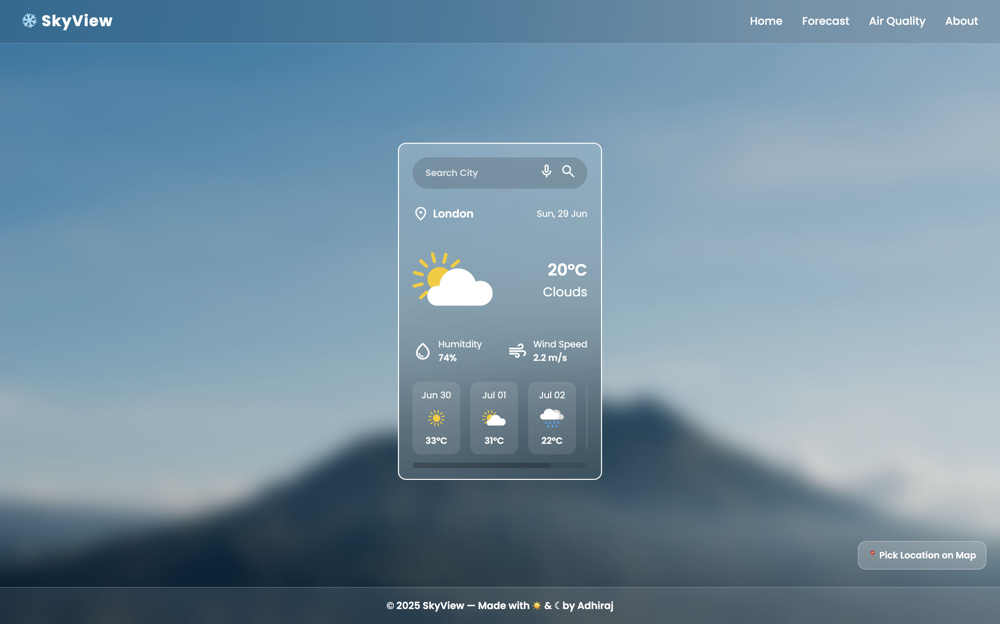
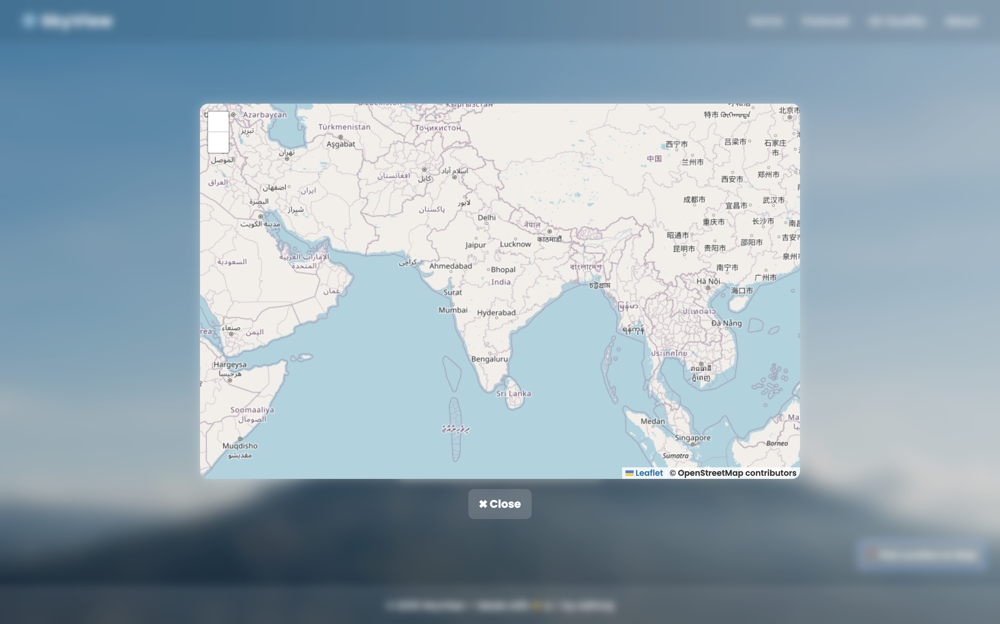
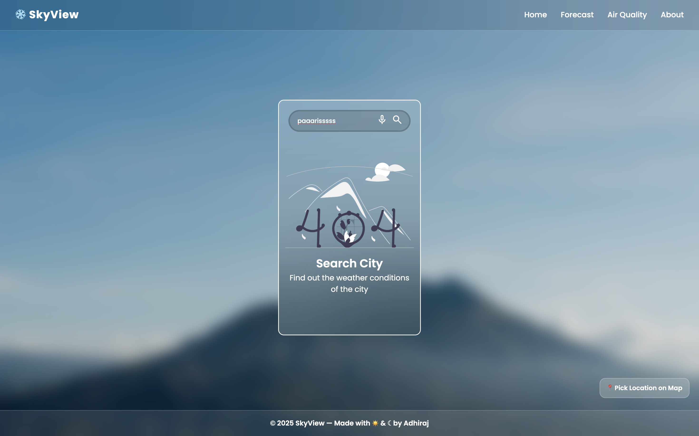
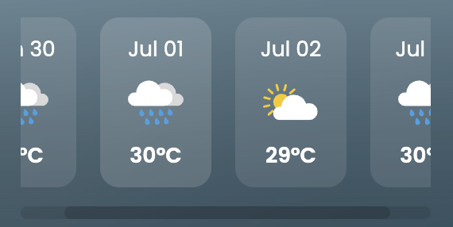

# 🌤️ SkyView

**SkyView** is a voice-enabled, map-integrated weather web app that delivers real-time weather forecasts in a beautifully designed UI.



---

## 🚀 Features

- 🔍 **City Search**: Enter any city name to get real-time weather and forecasts.
- 🎤 **Voice Recognition**: Search weather hands-free using your voice.
- 🗺️ **Map Pin Selection**: Click on a map to fetch weather for that specific location.
- 🌦️ **5-Day Forecast**: Scrollable forecast cards for upcoming weather conditions.
- 🔊 **Text-to-Speech Output**: The app speaks the current weather after searching.
- ❌ **Error State Handling**: Gracefully handles "City Not Found" with user-friendly UI.
- 🎨 **Glassmorphism UI**: A clean, elegant frontend with modern effects.
- 📱 **Fully Responsive Design**: Optimized layout that adapts across phones, tablets, and desktops.

---

## 🛠️ Tech Stack

- **HTML5**, **CSS3** (Glassmorphism design)
- **Vanilla JavaScript**
- **OpenWeather API** for real-time data
- **Leaflet.js + OpenStreetMap** for map integration
- **Web Speech API** for voice input & output

---

## 📸 Screenshots

| 🔍 Search UI | 🌤️ Weather View |
|--------------|------------------|
|  |  |

| 🗺️ Map Location Picker | ❌ City Not Found |
|------------------------|------------------|
|  |  |

### 📆 Forecast Scroll View



---

## 📦 How to Run Locally

1. Clone this repository:
   ```bash
   git clone https://github.com/codealchemy/skyview.git
   cd skyview
   ```

2. Add your **OpenWeather API key** in `script.js` (replace the placeholder)

3. Open `index.html` in your browser (preferably Chrome for full voice support)

---

## 🙌 Contributions

- Developed the full frontend UI and weather forecast system using HTML, CSS, and JavaScript.
- Integrated OpenWeather API for real-time data.
- Collaborated on features like voice input and map-based location selection.

---

## 🌐 Live Demo

> Coming soon... (To be deployed via GitHub Pages or Netlify)

---

## 📄 License

MIT License — free to use, modify, and share with credit 💙
